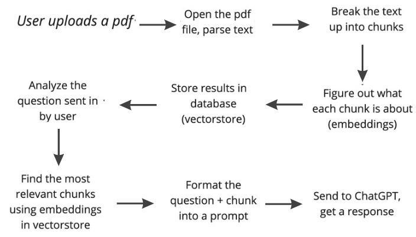
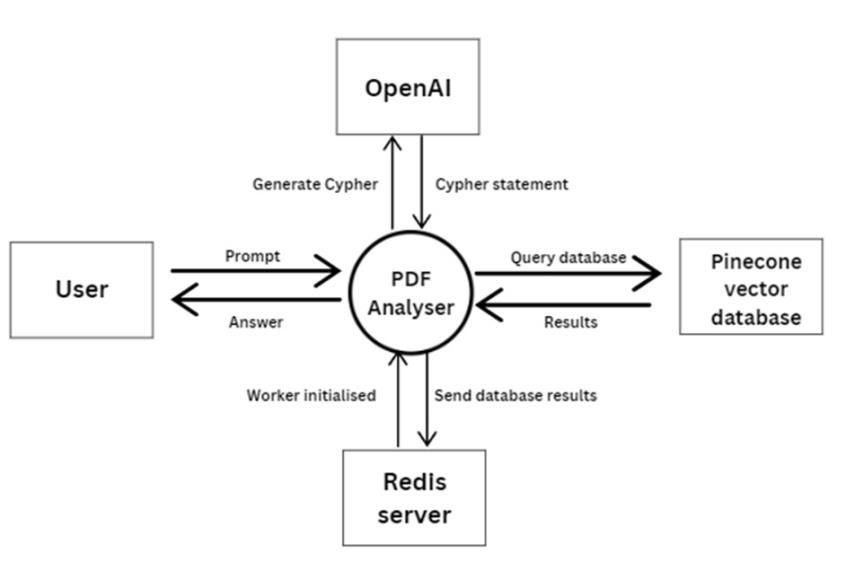
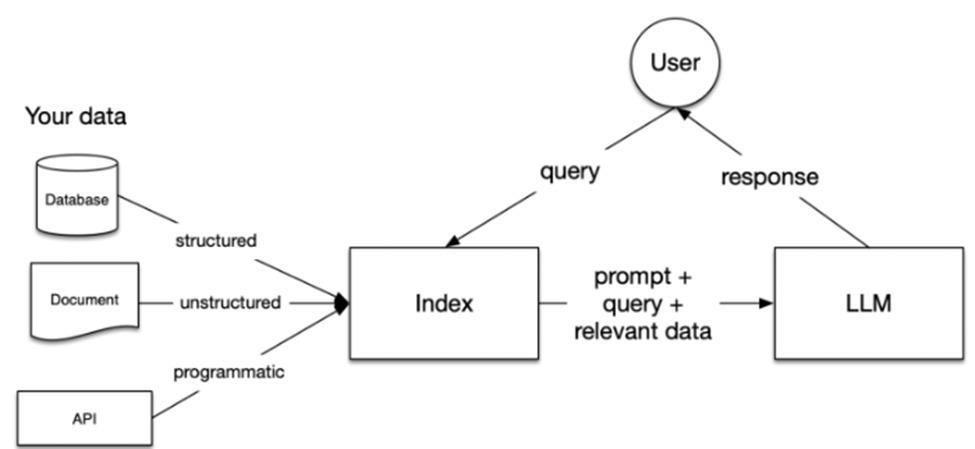
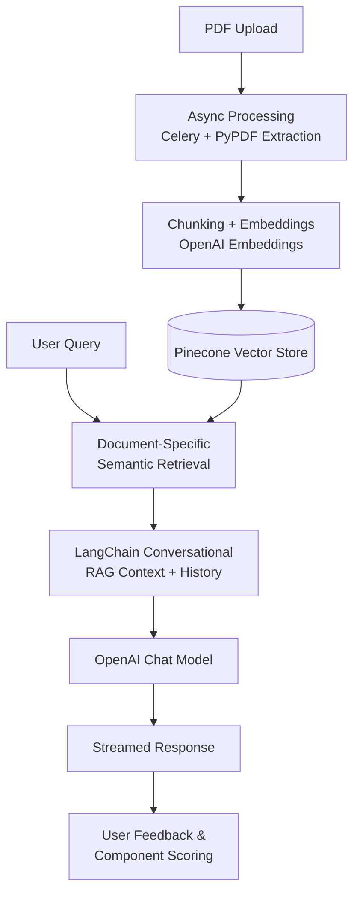
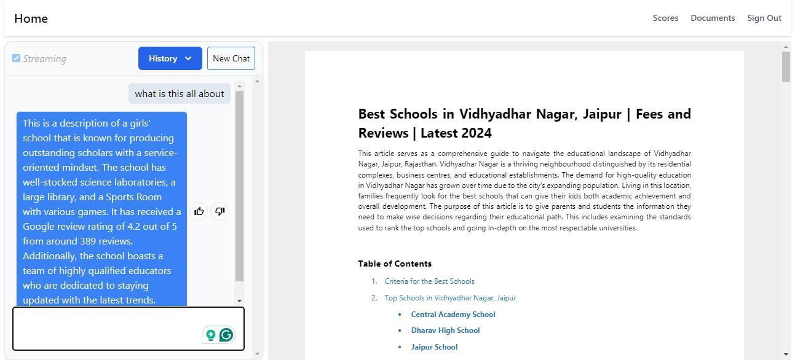
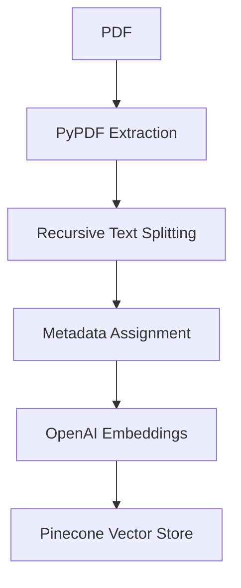
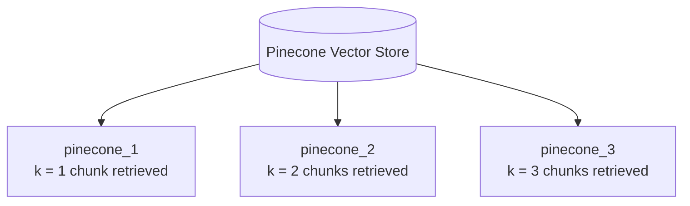
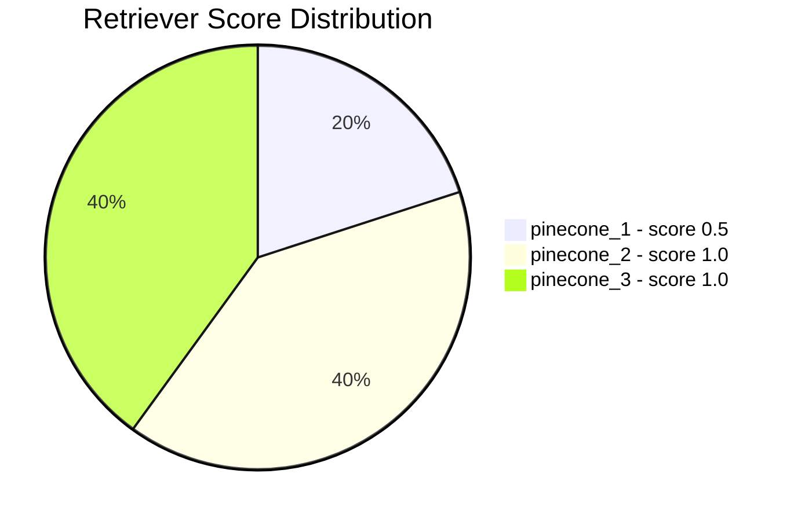

<div align="center">

# Retrieval-Augmented Generation with Semantic Search

### Document Retrieval System

Semantic Search · Retrieval-Augmented Generation · Large Language Models · LangChain

</div>

---

## 📌 Overview

This project is a document-centric conversational retrieval system. It combines semantic search, Retrieval-Augmented Generation (RAG), and LLMs to let users chat with uploaded PDF files. 

This repository contains the practical implementation associated with our research paper: *Retrieval-Augmented Generation with Semantic Search: Document Retrieval System*.

### Core Challenges Addressed

Traditional search often struggles when queries use different words than the source text. Managing large PDFs also introduces several practical challenges that this pipeline resolves:

- **Semantic Search**: Finding relevant passages even when exact keywords are missing.
- **PDF Chunking**: Dividing large documents into smaller, coherent segments for retrieval.
- **Context-Grounded Answers**: Supplying the LLM with exact text chunks so it generates accurate, context-aware answers.
- **Conversational Memory**: Saving chat history so users can ask natural follow-up questions.
- **Retrieval Depth**: Experimenting with different chunk counts ($k=1, 2, 3$) to optimize generation quality.
- **Feedback Loop**: Logging thumbs-up/down user ratings to evaluate and compare different pipeline components.

---

## 🧩 System Architecture

We use LangChain as the core framework to coordinate document processing, vector database storage, and LLM query orchestration.

The complete system architecture diagram, showing how ingestion, indexing, and chat streaming interact, is shown below:

<p align="center">
  
</p>

---

## 📊 System Data Flow (DFD)

The data flow is structured across Level 0 and Level 1 DFDs, mapping how data moves between the user, Svelte client, Flask API, Redis, Celery, and Pinecone:

### Level 0 DFD: High-Level Overview
A high-level view showing how users upload documents, submit questions, and receive streamed answers.

<p align="center">
  
</p>

### Level 1 DFD: Sub-Process Data Flow
A detailed view mapping background tasks: asynchronous text extraction, vector embeddings generation, Pinecone index updates, and conversational history retrieval.

<p align="center">
  
</p>

---

## 🔄 End-to-End Flow Diagram

The runtime interaction and asynchronous processing workflow follows this sequential pathway:

<div align="center">



</div>

---

## ✨ Key Capabilities

### 1. Chat with PDFs
Upload any PDF document and ask questions about its content through a conversational chat interface.

### 2. Semantic Search
Converts text chunks into vectors using OpenAI embeddings, enabling Pinecone to retrieve highly relevant passages based on meaning rather than exact keywords.

### 3. Conversational RAG
Uses LangChain to link retrieved document passages, user query, and chat history together before sending them to the LLM.

### 4. Document-Scoped Queries
Retriever queries are filtered by the selected PDF's unique ID, keeping answers strictly focused on that specific document.

### 5. Configurable Retrieval Depth
Supports three retriever configurations (`pinecone_1`, `pinecone_2`, `pinecone_3` for $k = 1, 2, 3$ chunks) to test how retrieval depth affects answer quality.

### 6. Multiple Model Options
Compatible with both GPT-4 and GPT-3.5-Turbo.

### 7. SQL-Backed Memory
Persists chat messages in a SQL database to maintain conversation history across sessions.

### 8. Real-Time Streaming
Streams tokens directly from the LLM to the frontend, so users don't have to wait for the entire answer to generate.

### 9. Component Evaluation
Logs user thumbs-up/down ratings to calculate and compare scores for different LLMs, retrievers, and memory modules.

---

## 🖥️ Application Preview

These screenshots show the actual user interface running in production:

### 📄 Document Upload
Drag-and-drop or select PDF files to start the asynchronous parsing and embedding pipeline.

<p align="center">
  
</p>

### 💬 Conversational Chat Window
Supports multi-turn chat, real-time response streaming, and relative citation references back to the PDF.

<p align="center">
  
</p>

---

## 📁 Project Structure

<details>
<summary><strong>Click to expand the project structure</strong></summary>

### Backend — `app/`

```text
app/
├── celery/
│   └── worker.py
│
├── chat/
│   ├── callbacks/
│   ├── chains/
│   ├── embeddings/
│   ├── llms/
│   ├── memories/
│   ├── vector_stores/
│   ├── chat.py
│   ├── create_embeddings.py
│   └── score.py
│
└── web/
    ├── db/
    ├── tasks/
    ├── views/
    ├── api.py
    ├── files.py
    └── config/
```

### Frontend — `client/`

```text
client/
└── src/
    ├── components/
    ├── routes/
    ├── store/
    └── ...
```

### Root files

```text
tasks.py
requirements.txt
Pipfile
Pipfile.lock
test.py
README.md
```

</details>

---

## 🛠️ Technology Stack

* **Backend**: Python, Flask, SQLAlchemy, Celery, Redis
* **Orchestration**: LangChain
* **AI/LLMs**: OpenAI API (Embeddings, GPT-4, GPT-3.5-Turbo)
* **Vector Store**: Pinecone
* **PDF Processing**: PyPDF, Recursive Text Splitting
* **Frontend**: Svelte, SvelteKit, TypeScript, Tailwind CSS, Chart.js

---

## 🔬 Research Implementation

This repository contains the practical implementation associated with our published research:

> Kaur, B., Deepanshu, Narang, A., & Vashisht, P. (2026).
> *Retrieval-Augmented Generation with Semantic Search: Document Retrieval System.*
> AIP Conference Proceedings, 3426, 020016.
> https://doi.org/10.1063/5.0327593

---

## ⚙️ Ingestion & Retrieval Details

### 📄 PDF Ingestion Pipeline

Uploaded PDFs are processed asynchronously in the background:

<div align="center">



</div>

The chunking configuration uses:
* **Chunk size**: 500 characters
* **Chunk overlap**: 100 characters

### 🔎 Vector Retrieval Configurations

We configure Pinecone to return different numbers of chunks to evaluate search depth:

| Configuration | Retrieval Depth |
|:---:|:---:|
| `pinecone_1` | k = 1 |
| `pinecone_2` | k = 2 |
| `pinecone_3` | k = 3 |

<div align="center">



</div>

---

## 🚀 Getting Started

### Prerequisites
Make sure you have these installed:
* Python 3.11+
* Node.js and npm
* Redis
* OpenAI and Pinecone accounts

### Backend Setup
Install Python dependencies and initialize the database:
```bash
pip install -r requirements.txt
flask --app app.web init-db
```

### Environment Config
Create a `.env` file in the project root:
```env
SECRET_KEY=your-secret-key
SQLALCHEMY_DATABASE_URI=your-database-uri
UPLOAD_URL=your-file-service-url
REDIS_URI=your-redis-url
OPENAI_API_KEY=your-openai-api-key
PINECONE_API_KEY=your-pinecone-api-key
PINECONE_ENV_NAME=your-pinecone-environment
PINECONE_INDEX_NAME=your-pinecone-index
```

> [!WARNING]
> Never commit real API keys, passwords, service tokens, or other secrets to GitHub.

### Running the Application

1. **Start Redis**:
   ```bash
   redis-server
   ```
2. **Start Flask Backend**:
   ```bash
   inv dev
   ```
3. **Start Celery Worker**:
   ```bash
   inv devworker
   ```
4. **Run Svelte Frontend**:
   ```bash
   cd client
   npm install
   npm run dev
   ```
   *Go to `http://localhost:5173` to open the local interface!*

---

## 📊 Evaluation & Feedback

Users can rate answers with thumbs-up/down. The application logs this feedback to maintain performance scores for different language models, retrievers, and memories, helping you identify the best pipeline configuration.

<div align="center">



</div>

---

## ⚠️ Limitations & Future Work

* **API Dependencies**: Relies entirely on external OpenAI and Pinecone services.
* **Plain Text focus**: PDF parsing currently extracts plain text, ignoring images and tables.
* **Simple evaluation**: Uses subjective user feedback rather than standardized test datasets.
* **Potential Extensions**: Reranking search results, multimodal parsing, local LLM integration, and automated RAG evaluation.

---

<div align="center">

### 📚 Research · Engineering · Intelligent Retrieval

*"Building intelligent software through research, engineering, and continuous learning."*

⭐ If you find my work interesting, feel free to explore my repositories or connect with me.

</div>
