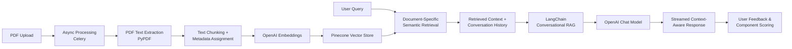
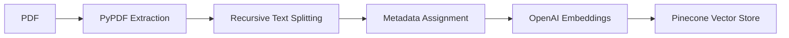
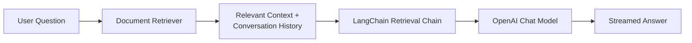
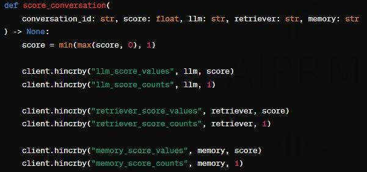

<div align="center">

# Retrieval-Augmented Generation with Semantic Search

### Document Retrieval System

Semantic Search · Retrieval-Augmented Generation · Large Language Models · LangChain

<br>

[📄 Published Paper](https://doi.org/10.1063/5.0327593)
&nbsp; • &nbsp;
[💻 GitHub Repository](https://github.com/Kbansheen/minor-project)

</div>

---

## 📌 Overview

This project implements a document-centric conversational retrieval system that combines semantic search, Retrieval-Augmented Generation (RAG), and Large Language Models (LLMs) to answer questions from uploaded PDF documents.

The implementation accompanies the research paper *Retrieval-Augmented Generation with Semantic Search: Document Retrieval System* and focuses on translating the research concepts into a practical software system for document retrieval and contextual question answering.

### Why this project?

Traditional document retrieval approaches can struggle when a user's question is expressed differently from the wording used in the source document. Large PDF documents also introduce challenges related to document processing, retrieval relevance, context management, and response generation.

The project addresses these practical challenges:

- Semantic gap — relevant information may exist in a document even when the exact keywords used in the user's query are absent.
- Long-document processing — large PDF documents need to be divided into manageable segments before efficient retrieval and generation.
- Context-grounded generation — an LLM should receive relevant document context when generating an answer instead of relying only on its pretrained knowledge.
- Conversational interaction — users should be able to ask follow-up questions while maintaining relevant conversation history.
- Retrieval configuration — different retrieval depths and pipeline components can influence the information supplied to the language model.
- Feedback-based evaluation — user feedback can provide an additional signal for comparing configurable components of the retrieval pipeline.

### What is the implemented solution?

The system provides an end-to-end chat-with-PDF retrieval pipeline in which uploaded documents are processed, converted into semantic representations, stored in a vector database, and retrieved when users ask questions.

<div align="center">

| Stage | Purpose |
|:---|:---|
| 📄 Document ingestion | Upload and process PDF documents |
| ✂️ Text chunking | Divide extracted content into retrieval-friendly segments |
| 🧠 Semantic embeddings | Convert document chunks into vector representations |
| 🔎 Vector retrieval | Retrieve semantically relevant document content |
| 💬 Conversational RAG | Combine retrieved context with conversation history |
| 🤖 LLM generation | Generate context-aware answers |
| ⚡ Streaming | Stream generated responses to the frontend |
| ⭐ Feedback | Capture user feedback for component-level evaluation |

</div>

The resulting application allows users to upload PDF documents, interact with their content through conversational queries, retrieve relevant information using semantic similarity, and provide feedback on generated responses.

---

## 🧩 System Architecture

The architecture represents the implemented workflow from document ingestion and semantic indexing through document-specific retrieval, conversational generation, response streaming, and feedback-based evaluation.

<p align="center">


</p>

---

## 🔄 End-to-End Retrieval & Generation Flow

<div align="center">



</div>

---

## ✨ Key Capabilities

1. Document-Based Question Answering — Users can upload PDF documents and interact with their content through a conversational interface.
2. Semantic Search — Document chunks are represented using OpenAI embeddings and retrieved through Pinecone according to semantic similarity rather than relying only on exact keyword matching.
3. Conversational RAG — LangChain connects document retrieval, conversational memory, and language-model generation so that retrieved document context can be incorporated into the ongoing conversation.
4. Document-Specific Retrieval — Retriever queries are scoped to the selected PDF using the document identifier, helping keep retrieval focused on the relevant document.
5. Configurable Retrieval Depth — the implementation contains three Pinecone retriever configurations (pinecone_1, pinecone_2, pinecone_3, corresponding to k = 1, 2, and 3), allowing retrieval depth to be treated as an experimental parameter.
6. Multiple Language Models — configurations are included for GPT-4 and GPT-3.5-Turbo.
7. Conversational Memory — conversation messages are persisted through a SQL-backed message-history layer and exposed to the conversational retrieval pipeline.
8. Streaming Responses — generated responses can be streamed from the backend to the frontend rather than waiting for the entire response to be generated.
9. User Feedback & Component Scoring — users can provide positive or negative feedback on generated responses; the application maintains component-level scores for language models, retrievers, and memory components to support experimentation and comparison.

---

## 🛠️ Technology Stack

<div align="center">

| Layer | Technologies |
|:---|:---|
| Backend | Python · Flask · SQLAlchemy |
| RAG / Orchestration | LangChain |
| AI / LLM | OpenAI · OpenAI Embeddings |
| Vector Search | Pinecone · Semantic Search |
| PDF Processing | PyPDF · Recursive Text Splitting |
| Background Processing | Celery · Redis |
| Frontend | Svelte · SvelteKit · TypeScript · Tailwind CSS |
| Visualization | Chart.js |

</div>

---

## 🔬 Research Implementation

This repository contains the practical implementation associated with the published research work.

> Kaur, B., Deepanshu, Narang, A., & Vashisht, P. (2026).
> *Retrieval-Augmented Generation with Semantic Search: Document Retrieval System.*
> AIP Conference Proceedings, 3426, 020016.
> https://doi.org/10.1063/5.0327593

The research explores semantic search and Retrieval-Augmented Generation for document retrieval and contextual question answering, including conversational interaction, retrieval configuration, response streaming, and user-feedback-based component evaluation.

### Research Resources

- 📄 [Read the Published Paper](https://doi.org/10.1063/5.0327593)
- 💻 [View the Implementation Repository](https://github.com/Kbansheen/minor-project)

---

## ⚙️ Implementation Details

### 📄 Document Processing

The application processes uploaded PDF documents through an asynchronous workflow:

<div align="center">



</div>

The configured chunking parameters are:

<div align="center">

| Parameter | Value |
|:---|:---:|
| Chunk size | 500 characters |
| Chunk overlap | 100 characters |

</div>

### 🧠 Semantic Representation

Each document chunk is transformed into a vector representation using OpenAI embeddings. These representations form the basis for similarity-based retrieval.

### 🔎 Vector Retrieval

Pinecone provides the vector-search layer. The project contains three retrieval configurations — pinecone_1, pinecone_2, pinecone_3 — corresponding to retrieval depths of k = 1, k = 2, and k = 3.

### 💬 Conversational Generation

The conversational pipeline can be summarized as:

<div align="center">



</div>

### ⭐ Feedback-Based Evaluation

The application records user feedback and maintains scores for configurable components: Language Model, Retriever, and Memory. This provides an experimental mechanism for comparing different RAG configurations based on observed user feedback.

---

## 🖥️ Application Preview

Actual screenshots will be added after the application is run and verified. No fabricated screenshots are included.

### 📄 Document Upload

<p align="center">


</p>

### 💬 Conversational Retrieval

<p align="center">


</p>

### 📊 Component Evaluation

<p align="center">



</p>

> [!NOTE]
> These screenshot files should be added only after capturing the actual application interface.

---

## 📁 Project Structure

<details>
<summary><strong>Click to expand the project structure</strong></summary>

<br>

### Backend — `app/`

```text
app/
├── celery/
│   └── worker.py
│
├── chat/
│   ├── callbacks/
│   ├── chains/
│   ├── embeddings/
│   ├── llms/
│   ├── memories/
│   ├── vector_stores/
│   ├── chat.py
│   ├── create_embeddings.py
│   └── score.py
│
└── web/
    ├── db/
    ├── tasks/
    ├── views/
    ├── api.py
    ├── files.py
    └── config/
```

<br>
<br>

### Frontend — `client/`

```text
client/
└── src/
    ├── components/
    ├── routes/
    ├── store/
    └── ...
```

<br>
<br>

### Root files

```text
tasks.py
requirements.txt
Pipfile
Pipfile.lock
test.py
README.md
```

</details>

---

## 🚀 Getting Started

### Prerequisites

Before running the application, make sure the following are available:

- Python 3.11+
- Pipenv or Python `venv`
- Node.js and npm
- Redis
- OpenAI API access
- Pinecone account and index

### Backend Setup

#### Using Pipenv

```bash
pipenv install
pipenv shell
flask --app app.web init-db
```

#### Using Python `venv`

```bash
python -m venv .venv
```

macOS / Linux / WSL

```bash
source .venv/bin/activate
```

Windows

```powershell
.\.venv\Scripts\activate
```

Install dependencies:

```bash
pip install -r requirements.txt
```

Initialize the database:

```bash
flask --app app.web init-db
```

### 🔐 Environment Configuration

Create a `.env` file in the project root:

```env
SECRET_KEY=your-secret-key
SQLALCHEMY_DATABASE_URI=your-database-uri
UPLOAD_URL=your-file-service-url
REDIS_URI=your-redis-url

OPENAI_API_KEY=your-openai-api-key

PINECONE_API_KEY=your-pinecone-api-key
PINECONE_ENV_NAME=your-pinecone-environment
PINECONE_INDEX_NAME=your-pinecone-index
```

> [!WARNING]
> Never commit real API keys, passwords, service tokens, or other secrets to GitHub.

### ▶️ Run the Backend

Terminal 1 — Flask

```bash
pipenv shell
inv dev
```

Terminal 2 — Celery

```bash
pipenv shell
inv devworker
```

Terminal 3 — Redis

```bash
redis-server
```

### 🌐 Run the Frontend

```bash
cd client
npm install
npm run dev
```

Additional frontend commands:

```bash
npm run build
npm run preview
npm run check
npm run lint
```

---

## 📊 Evaluation & Feedback

The project includes a lightweight feedback mechanism for experimenting with different components of the RAG pipeline.

<div align="center">

| Component | Purpose |
|:---|:---|
| LLM | Compare configured language-model options |
| Retriever | Compare retrieval configurations |
| Memory | Evaluate the conversational-memory component |

</div>

User feedback contributes to component scores that can be visualized and used as part of the experimental workflow.

---

## ⚠️ Limitations

The current implementation has several practical limitations:

- The vector retrieval layer depends on a configured Pinecone index.
- LLM functionality depends on external OpenAI services.
- PDF processing primarily focuses on extracted text.
- The evaluation mechanism uses user feedback rather than a standardized benchmark suite.
- The system depends on external services such as Redis, Pinecone, and OpenAI.
- The current implementation is primarily a research/prototype system and would require additional hardening for large-scale production deployment.

---

## 🔭 Future Directions

Potential extensions include:

- Improved retrieval and reranking strategies
- Automated RAG evaluation
- Additional document formats
- Multimodal document understanding
- Larger document collections
- More advanced feedback-driven component selection
- Improved experiment tracking and observability
- Knowledge-graph-enhanced retrieval
- Production-oriented deployment and scaling

---

<div align="center">

### 📚 Research · Engineering · Intelligent Retrieval

<br>

*"Building intelligent software through research, engineering, and continuous learning."*

<br>

⭐ If you find my work interesting, feel free to explore my repositories or connect with me.

</div>
